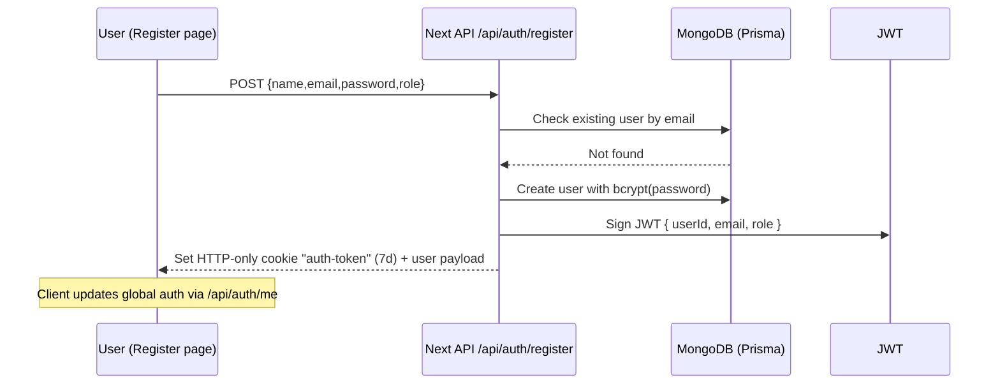
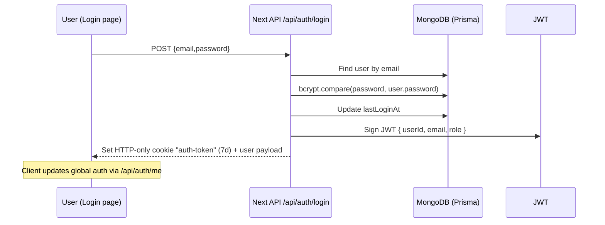
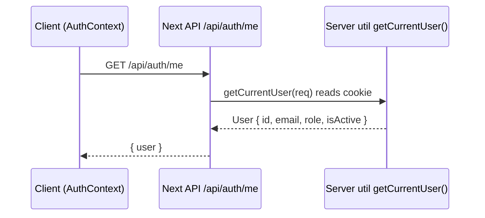

## Daily Progress – Task & Quiz Manager (Kwizi)

Modern, role-based learning platform built with Next.js App Router. It combines quiz management, a daily task planner, and progress analytics with a simple local JWT authentication system.

### What you’ll find here

-   Detailed overview of the top 12 features (including Login/Sign up and how they work)
-   Tech stack and what each dependency is used for
-   File and route guide: which file does what
-   Simple diagrams (auth, middleware, quiz flows)
-   Setup, seeding, and admin bootstrap
-   A detailed guide map to explore the app quickly

## 0) Quick Start

1. Prerequisites

-   Node.js 18+ and npm
-   A MongoDB database (Atlas or local)

2. Install and configure

```bash
npm install
```

Create `.env.local` (required):

```
DATABASE_URL="<your-mongodb-connection-string>"
JWT_SECRET="<a-long-random-secret>"
```

3. Bootstrap the database (Prisma + seed)

```bash
npm run db:setup    # runs: prisma generate, prisma db push, basic seed
# or, for rich sample data (multiple subjects/categories):
npm run db:seed:all           # add --clear to reset quiz data
```

4. Start the app

```bash
npm run dev
# open http://localhost:3000
```

5. Create an admin quickly (optional)

```bash
node scripts/create-local-admin.js admin@test.com admin123 "Admin User"
```

Notes

-   You can self-register users (student/teacher/admin) on `/register`.
-   Login demo credentials are shown on `/login` but you must create the users first (either register or use the script above for admin).

## 1) Top 12 Features (What + How + Where)

Below each feature includes the “What”, “How it works”, and “Where in code”.

1. Authentication (Login / Sign Up / Logout)

-   What: Local auth using email + password with bcrypt hashing and JWT stored in an HTTP-only cookie.
-   How it works:
    -   Sign Up: Client posts to `/api/auth/register`. Server validates, hashes password (bcrypt), creates user, signs JWT, and sets `auth-token` HTTP-only cookie.
    -   Login: Client posts to `/api/auth/login`. Server verifies password, updates `lastLoginAt`, signs JWT, sets cookie.
    -   Logout: Client posts to `/api/auth/logout`. Server clears the cookie.
    -   Client state: `AuthContext` calls `/api/auth/me` to resolve the current user and roles.
-   Where:
    -   Pages: `app/login/page.tsx`, `app/register/page.tsx`
    -   Routes: `app/api/auth/{login,register,logout,me}/route.ts`
    -   Core: `utils/auth.ts` (JWT verify, current user, role guards)
    -   Middleware guard: `middleware.ts`

2. Role-Based Access Control (RBAC) & Middleware

-   What: Admin/Teacher/Student roles with server-side route protection.
-   How it works: `middleware.ts` skips public routes and enforces auth for protected ones. Admin routes require `admin`; teacher routes require `teacher` or `admin`.
-   Where: `middleware.ts`, `utils/auth.ts`, `utils/roles.ts`

3. Quiz Browsing & Details

-   What: Browse available quizzes, view details, and start setup.
-   How it works: `GET /api/quizzes` returns active quizzes (with question metadata). `GET /api/quizzes/[id]` returns a single quiz with questions/options.
-   Where: Page `app/quizzes/page.tsx` (listing), `app/quiz/setup/[quizId]/page.tsx` (setup), Routes `app/api/quizzes/route.ts`, `app/api/quizzes/[id]/route.ts`

4. Quiz Setup (Count + Difficulty Filter)

-   What: Choose number of questions and filter by difficulty before starting.
-   How it works: Loads quiz by ID, filters questions by difficulty, stores setup and filtered questions in `localStorage`, then navigates to `/quiz`.
-   Where: `app/quiz/setup/[quizId]/page.tsx`

5. Quiz Attempt Interface

-   What: Clean UI with shuffled questions/options, answer selection, and progress controls.
-   How it works: Uses local state for responses. Enforces selection per question. On finish, responses are stored locally and results posted for persistence if the user is logged in.
-   Where: `app/quiz/page.tsx`

6. Auto-Grading & Submissions

-   What: Server computes score and stores submission/answers for logged-in students.
-   How it works: `POST /api/user/quiz/finish` validates payload, upserts `QuizSubmission`, replaces `QuizAnswer` rows, and returns submission info.
-   Where: `app/api/user/quiz/finish/route.ts`

7. Leaderboard & Ranking

-   What: Average scores and rankings with time filters (all/week/month/today).
-   How it works: Aggregates scores from `QuizSubmission` by user, computes averages and rank.
-   Where: Page `app/leaderboard/page.tsx`, Route `app/api/leaderboard/route.ts`

8. Teacher Question Bank

-   What: Teachers can add/edit/delete and share reusable questions.
-   How it works: CRUD over `QuestionBank` with owner-only updates/deletes; shared questions visible to all teachers.
-   Where: Page `app/teacher/question-bank/page.tsx`, Routes `app/api/teacher/question-bank/*`

9. Teacher Quiz Builder

-   What: Create quizzes with multiple question types and options.
-   How it works: Client assembles quiz payload; server creates quiz and nested questions/options in a single call.
-   Where: Page `app/teacher/quiz/create/page.tsx`, Route `app/api/teacher/quizzes/route.ts`

10. Admin – User Management

-   What: List/search/filter users, create users, edit role/status, delete users.
-   How it works: Admin-only API with pagination and secure mutations.
-   Where: Page `app/admin/users/page.tsx`, Routes `app/api/admin/users/*`

11. Admin – Quiz Management

-   What: Global quiz list with status, statistics, and moderation (activate/deactivate/delete).
-   How it works: Admin-only API fetches quizzes with counts and computed stats; supports updates and deletion.
-   Where: Page `app/admin/quizzes/page.tsx`, Route `app/api/admin/quizzes/route.ts`

12. Daily Task Planner

-   What: Create/edit/delete personal tasks with categories, priority, and due dates (notifications stored in DB).
-   How it works: Authenticated CRUD against `Task`; creates a `Notification` for due-dated tasks.
-   Where: Page `app/tasks/page.tsx`, Routes `app/api/tasks/*`

## 2) Tech Stack (What each piece is used for)

-   Framework: Next.js 15 App Router (`app/` directory)
-   UI: React 19, Tailwind CSS, shadcn/ui primitives via `class-variance-authority` and Radix
-   Auth: Local JWT with `jsonwebtoken` and password hashing via `bcryptjs`
-   Data: Prisma 6 with MongoDB provider
-   HTTP: `axios` for client requests, Next.js Route Handlers for server APIs
-   Charts/Icons/UX: `recharts`, `lucide-react`, `react-hot-toast`

Key packages from `package.json`

-   `next`, `react`, `react-dom`: core web app
-   `@prisma/client`, `prisma`: ORM and codegen
-   `jsonwebtoken`, `bcryptjs`: auth & security
-   `axios`: client-side HTTP
-   `class-variance-authority`, `@radix-ui/*`: UI primitives
-   `recharts`, `react-hot-toast`, `lucide-react`: charts, toasts, icons

## 3) How Authentication Works (Detailed)

Mermaid sequence – Register



Mermaid sequence – Login



Mermaid sequence – Resolve Current User



Security notes

-   JWT stored in HTTP-only cookie (`auth-token`, `sameSite: lax`, `secure` in production)
-   Passwords hashed with bcrypt (12 salt rounds used in registration/admin create)
-   Role checks are server-side in middleware and in protected route handlers

## 4) Middleware & Route Protection

`middleware.ts` controls access:

-   Public routes: `/`, `/login`, `/register`, `/api/auth/*`, plus selected public resources like `/quizzes`, `/leaderboard`, `/stats`, `/results`, `/tasks` (see matcher in code)
-   Admin routes: `/admin/*`, `/api/admin/*` require role `admin`
-   Teacher routes: `/teacher/*`, `/api/teacher/*` require `teacher` or `admin`

Mermaid flow – Middleware

```mermaid
flowchart TD
  A[Request] --> B{Public Route?}
  B -- Yes --> C[Allow]
  B -- No --> D[getCurrentUser(req)]
  D -- No User --> E[Redirect /login]
  D -- User --> F{Admin/Teacher Path?}
  F -- Admin Path --> G{user.role === admin}
  G -- true --> C
  G -- false --> H[Redirect /]
  F -- Teacher Path --> I{role teacher or admin}
  I -- true --> C
  I -- false --> H
```

## 5) Data Model (Prisma, MongoDB)

Main models (simplified):

-   `User`: email (unique), password (hashed), role, name, status
-   `Quiz`: title, description, timeLimit, relations to `Question`, `QuizSubmission`
-   `Question`: text, type, difficulty, `Option[]`
-   `Option`: text, isCorrect
-   `QuizSubmission`: user, quiz, score, totals, `QuizAnswer[]`
-   `QuizAnswer`: per-question answer (selected option), correctness
-   `QuizAssignment`: optional linkage for assignments (teacher->student)
-   `Task`: personal tasks
-   `Notification`: stored reminders/updates
-   `QuestionBank`: teacher’s reusable questions; sharable
-   `AuditLog`: reserved for admin auditing

See full schema: `prisma/schema.prisma`.

## 6) File & Route Guide (Which file does what)

Core auth

-   `utils/auth.ts`: JWT secret lookup, `getCurrentUser`, `requireAuth`, `requireAdmin`, `requireTeacher`
-   `middleware.ts`: global route access control
-   `context/AuthContext.tsx`: client auth state, roles, and `checkAuth()`

Auth pages & routes

-   Pages: `app/login/page.tsx`, `app/register/page.tsx`
-   API: `app/api/auth/{login,register,logout,me}/route.ts`

Quizzes

-   Browse/listing: `app/quizzes/page.tsx` (grid of quizzes)
-   Setup: `app/quiz/setup/[quizId]/page.tsx`
-   Attempt: `app/quiz/page.tsx`
-   API: `app/api/quizzes/route.ts`, `app/api/quizzes/[id]/route.ts`
-   User quiz start/finish: `app/api/user/quiz/{start,finish}/route.ts`

Teacher

-   Question bank page: `app/teacher/question-bank/page.tsx`
-   Question bank API: `app/api/teacher/question-bank/*`
-   Create quiz page: `app/teacher/quiz/create/page.tsx`
-   Quizzes API: `app/api/teacher/quizzes/route.ts`

Admin

-   Users page: `app/admin/users/page.tsx`
-   Users API: `app/api/admin/users/*`
-   Quizzes page: `app/admin/quizzes/page.tsx`
-   Quizzes API: `app/api/admin/quizzes/route.ts`

Leaderboard & Stats

-   Leaderboard page: `app/leaderboard/page.tsx`
-   Leaderboard API: `app/api/leaderboard/route.ts`
-   Stats page: `app/stats/page.tsx`

Tasks

-   Tasks page: `app/tasks/page.tsx`
-   Tasks API: `app/api/tasks/*`

Foundation

-   Prisma client: `utils/connect.ts`
-   Types: `types/types.ts`
-   UI components: `components/*` (shadcn-like primitives under `components/ui`)
-   Seed scripts: `scripts/*` (e.g., `seed.js`, `seed-all.js`, `create-local-admin.js`)

## 7) Typical Flows

Login flow (client perspective)

1. User submits email + password on `/login`
2. Client POSTs to `/api/auth/login`
3. Server sets `auth-token` cookie
4. Client calls `checkAuth()` which GETs `/api/auth/me` and populates `AuthContext`
5. User routed by role: admin → `/admin`, teacher → `/teacher`, student → `/`

Register flow is identical except POST `/api/auth/register` first.

Start & finish quiz

1. Navigate to quiz detail/setup
2. Choose question count and difficulty → stored in `localStorage`
3. Navigate to `/quiz` (shuffled questions/options)
4. On finish, client computes score and POSTs to `/api/user/quiz/finish` (if signed-in student) to persist

## 8) Guide Map (Pages and APIs)

App pages (user-visible)

-   `/` Home: feature overview, featured quizzes, role tiles
-   `/login` / `/register`: local authentication pages
-   `/quizzes`: browse all quizzes (student)
-   `/quiz/setup/[quizId]`: configure a quiz attempt
-   `/quiz`: take the quiz
-   `/results`: view local results (after finish)
-   `/leaderboard`: rankings and stats
-   `/stats`: personal progress (user)
-   `/tasks`: daily task planner
-   `/teacher`: teacher dashboard (entry)
-   `/teacher/question-bank`: manage reusable questions
-   `/teacher/quiz/create`: build a new quiz
-   `/admin`: admin dashboard (entry)
-   `/admin/users`: manage users
-   `/admin/quizzes`: moderate quizzes

API routes (server handlers)

-   Auth: `/api/auth/{login,register,logout,me}`
-   Quizzes (public): `/api/quizzes`, `/api/quizzes/[id]`
-   User quiz: `/api/user/quiz/{start,finish}`
-   Leaderboard: `/api/leaderboard`
-   Tasks: `/api/tasks`, `/api/tasks/[taskId]`
-   Teacher: `/api/teacher/quizzes`, `/api/teacher/question-bank`, `/api/teacher/question-bank/[questionId]`, `/api/teacher/question-bank/[questionId]/share`
-   Admin: `/api/admin/users`, `/api/admin/users/[userId]`, `/api/admin/quizzes`

## 9) Local Development Tips

-   Env checks: `scripts/setup-db.js` validates `DATABASE_URL` and runs Prisma + seed
-   Prisma Studio: `npm run db:studio` to browse data
-   Rich seed set: `npm run db:seed:all` (add `--clear` to wipe quiz data first)
-   Create an admin fast: `node scripts/create-local-admin.js ...`
-   Common errors:
    -   Missing `JWT_SECRET` → auth utilities will throw
    -   Empty `DATABASE_URL` → setup script fails early

## 10) Conventions & Patterns

-   Server-only auth checks happen inside route handlers (`requireAdmin`, `requireTeacher`, `requireAuth`) and at the edge in `middleware.ts`
-   Client avoids directly reading cookies; it relies on `/api/auth/me`
-   Functional React with local state; global auth in `AuthContext`
-   UI primitives under `components/ui/` follow shadcn-like patterns

## 11) Extending Safely

-   New Protected API Route: call `requireAdmin(req)` or `requireTeacher(req)` at the top, then perform DB work
-   New Page: decide if route is public or protected; if protected, middleware will redirect unauthenticated users
-   New Question Types: extend schema (`Question.type`), adjust create/editor UIs, and quiz renderer

## 12) License & Credits

This project uses open-source packages (see `package.json`). Educational usage is encouraged.
